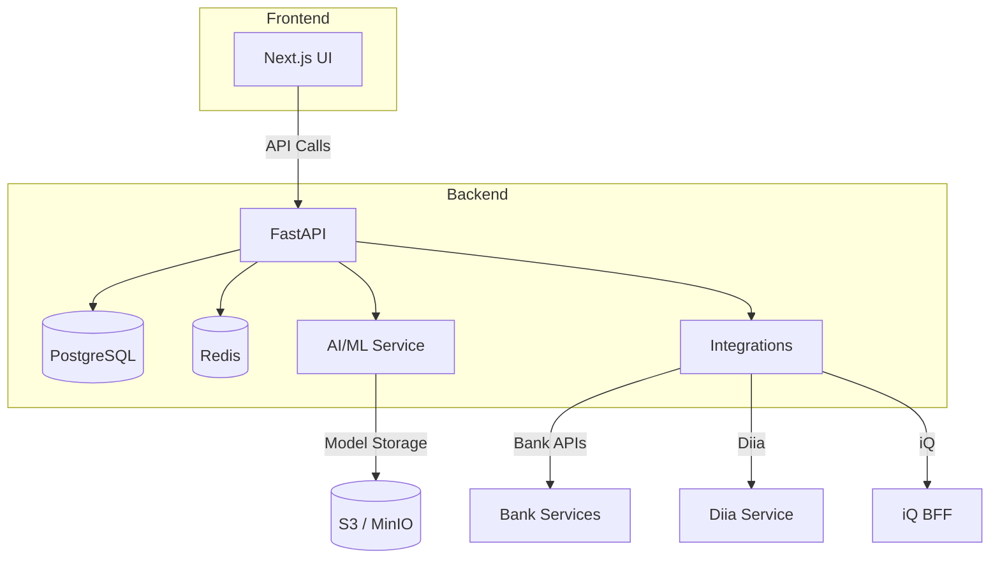

# Architecture Overview

The diagram shows the high‑level components and their interactions. The frontend talks to the FastAPI backend, which accesses the database, cache, AI/ML layer and external integrations. All services are containerised and orchestrated with Kubernetes.
